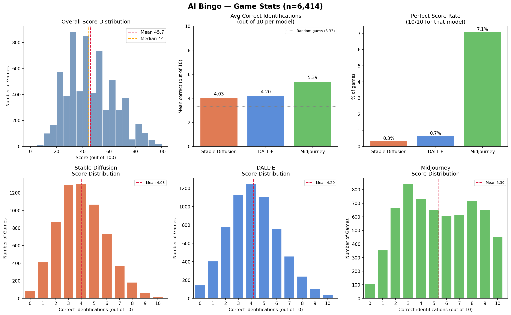

In 2023, as generative AI was taking off, everyone had opinions about which model was best — and I read a lot of beliefs that "model X always does Y." I wondered how well people could actually tell them apart. So I built AI Bingo: players are shown 3 images per round across 10 rounds, and must match each image to its generator — Midjourney, DALL·E, or Stable Diffusion.

The game collected **6,414 plays**. The results were more interesting than I expected:

- **Mean score: 46/100** — barely above random chance (33). This is not an easy game!
- **Midjourney** was by far the most recognizable (avg 5.4/10 correct, 7.1% perfect), unsurprising given its distinctive style.
- **DALL·E and Stable Diffusion** were nearly indistinguishable from each other (4.0 and 4.2/10).
- Midjourney's score distribution is notably bimodal — players either identified it well or not at all, with little middle ground.

The game got traction on the Midjourney subreddit, which likely skewed the sample toward users already familiar with that model's aesthetic. This is not a proper scientific experiment — but the data holds up as a fun snapshot of how recognizable these early models actually were.

_(Collected over an unknown time window — I forgot I was tracking data and, inexplicably, didn't add timestamps to the records.)_
