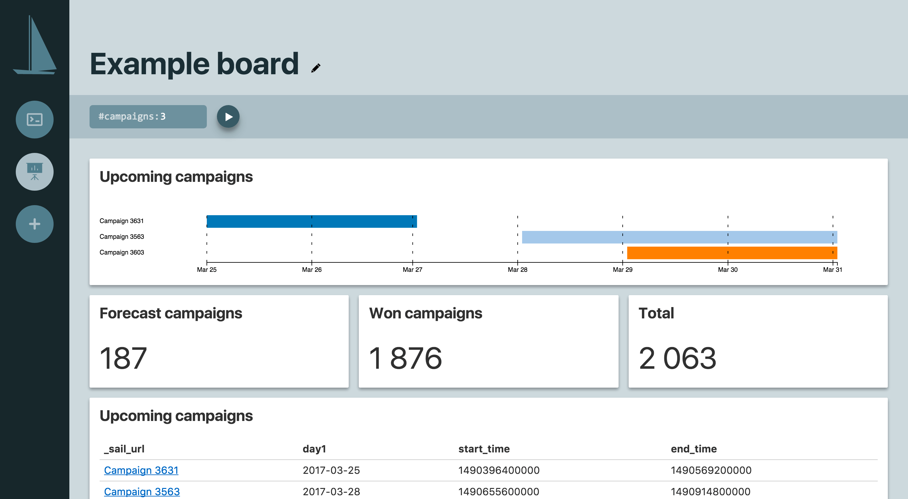
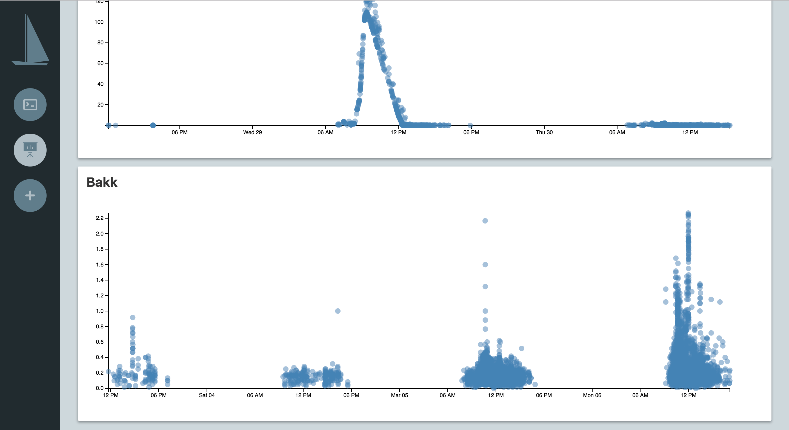

A database browser. Sail allows browsing the contents of a MySQL database via SQL queries, or by right-clicking values to create joins. The primary focus is keeping all query results on page (unlike PHPMyAdmin) so coming back to a previous result is fast and convenient. It also provides a way to bundle multiple queries together as a "board", which can display results as tables or more visual formats like scatter plots.

## Example board

## Example: Plot

